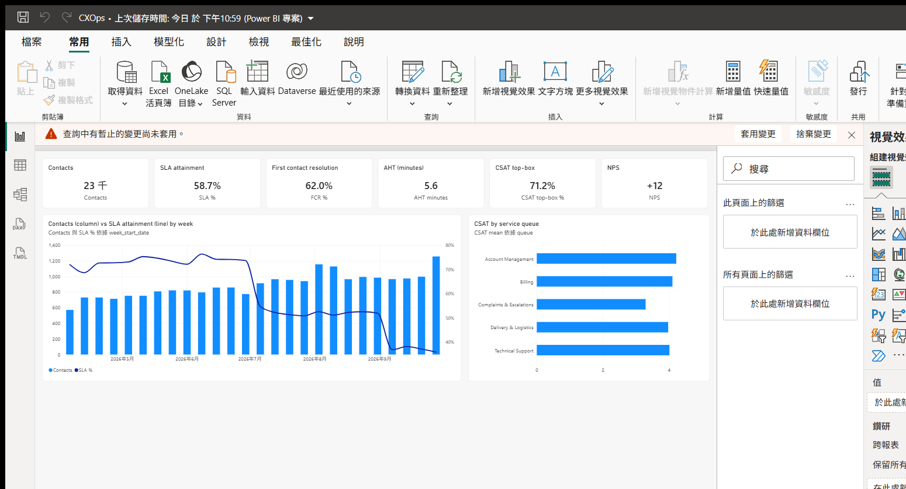
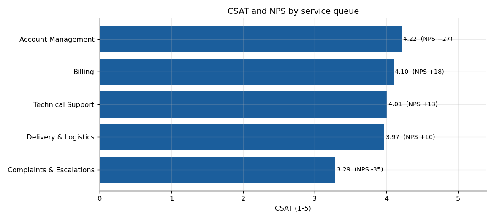

# Customer-Experience Analytics Portfolio — Un Chi Kit

**Two connected pieces of work built around one synthetic customer-service dataset: 23,162 contacts, 15,721 cases, 26 weeks, 5 channels.** Every number in this repository is reproducible from the included scripts — nothing is hand-written.

> ### 中文摘要（給 HR 的 30 秒版）
> 我把 26 週、**23,162 通**客戶聯絡（15,721 個案、5 條服務渠道）建成一個客服營運分析系統：
> ① 以 Power BI 建立 36 條量值的即時營運儀表板（SLA、首次解決率、處理時間、積壓帳齡、CSAT/CES/NPS、成本）；
> ② 以 SPSS + Python 做統計檢定與驅動因子分析，找出真正影響客戶滿意度的因素。
> 兩個最重要的發現：**首次聯絡解決率（FCR）是滿意度的最強驅動因子**（標準化 β = +0.49），以及
> **電話等候時間在第 14 週起倍增、Email 首次回覆 SLA 在第 23 週由 80.6% 崩至 23.9%**。
> 所有資料為合成資料（生成器公開），方法與工具鏈與真實專案相同。

---

## At a glance

| 23,162 | 36 | 30 | +11.6 |
|:--:|:--:|:--:|:--:|
| service contacts modelled | Power BI measures (DAX) | automated data-quality checks | NPS (bootstrap 95% CI +9.1 to +14.0) |

**Read first:** [Portfolio summary — 2 pages (PDF)](portfolio/Portfolio_Summary_UnChiKit.pdf) ·
[Statistical findings report — 4 pages, bilingual (PDF)](03-ops-dashboard/outputs/findings.pdf)

---

## 1 · Customer-service operations dashboard — Power BI · SQL · Python



A single report page over a **star-schema model** (7 tables: one contact-grain fact table plus date, channel, queue, agent, customer and status dimensions), with **36 DAX measures** covering SLA attainment, first-contact resolution, handle time, backlog ageing, CSAT/CES/NPS and cost per contact, and **30 automated data-quality checks** that block a refresh when the data is wrong.

| Finding | Evidence |
|---|---|
| Phone wait time doubled from week 14 | CES 5.09 → 3.98 (−1.11, p < .001); CSAT 4.18 → 3.37 |
| Email first-response SLA collapsed from week 23 | 80.6% → 23.9% (p ≈ 1e-296); open backlog concentrated in the 7–30 day bucket |
| The volume spike was **not** an experience problem | Billing contacts 153 → 302 per week with satisfaction flat (4.01 vs 4.11) |

Every KPI is validated against an independent pandas implementation, so the dashboard numbers are provably reproducible: [reference values](03-ops-dashboard/outputs/kpi_reference.md).

→ [Metric definitions and pitfalls](03-ops-dashboard/docs/metrics-definitions.md) ·
[Data model](03-ops-dashboard/docs/data-model.md) ·
[DAX measures](03-ops-dashboard/docs/dax-measures.md) ·
[Power BI project file](03-ops-dashboard/powerbi/CXOps.pbip)

## 2 · Customer-experience metrics & statistical analysis — SPSS · Python



An **SPSS-native dataset** (`.sav` with variable labels, value labels and measurement levels) plus full **SPSS syntax** for the metric definitions, bootstrap confidence intervals, chi-square, Welch t-tests, ANOVA with Tukey post-hoc, Kruskal-Wallis, standardised-beta driver analysis and ordinal logistic regression (PLUM) — cross-checked procedure by procedure against a Python implementation.

- **NPS +11.6** (41.7% promoters, 30.1% detractors), bootstrap 95% CI [+9.1, +14.0] — resampled, because NPS is a difference of proportions rather than a mean.
- **First-contact resolution is the dominant driver of CSAT** (standardised β = +0.49, R² = 0.347), ahead of escalation (−0.24), transfers (−0.11) and wait time (−0.04).
- Channel and NPS group are **not independent** (χ² = 209.7, df 8, p < .001, Cramér's V = 0.157).
- **Methodological control:** pooling wait time across channels suggests longer waits *improve* resolution (+0.39, p < .001). Tested within channel the effect disappears and reverses for live chat (−0.12, p = .002) — a channel confound that would otherwise have produced the wrong recommendation.

→ [SPSS ⇄ Python equivalence table](03-ops-dashboard/outputs/spss_equivalence.md) ·
[SPSS syntax](03-ops-dashboard/analysis/cx_metrics.sps) ·
[JASP/PSPP notes](03-ops-dashboard/README.md)

## What this demonstrates

| Requirement (from a customer-experience / business-systems data role) | Where it is demonstrated |
|---|---|
| Develop and maintain databases and data systems | Star schema (7 tables), surrogate keys, SQL data-quality gates, seeded and reproducible pipeline |
| Automate workflows for real-time analytics and performance tracking | Dashboard refresh driven by generated source files; 30 checks that block a bad refresh; model and report definitions generated from code (TMDL / PBIR) |
| Use statistical tools to diagnose and predict | Bootstrap CIs, chi-square, Welch t-tests, ANOVA + Tukey, Kruskal-Wallis, multiple regression, ordinal logistic regression |
| Design and analyse NPS / CES / CSAT surveys | Full metric definitions with the classic traps documented; response-rate and non-response handling; driver analysis |
| Process structured and unstructured customer feedback | Structured feedback modelled end to end (contact, case, survey grain); text-analytics pipeline planned as the next piece |
| Power BI · SPSS · Python · SQL · Excel/VBA | Used throughout — DAX measures, SPSS syntax and `.sav`, pandas/scipy/statsmodels, T-SQL, VBA macros |

## Reproduce it

```bash
cd 03-ops-dashboard
python src/generate_data.py      # seeded synthetic dataset (26 weeks of contact events)
python src/dq_checks.py          # 30 data-quality checks - all must pass
python src/kpi_reference.py      # every KPI + statistical test -> outputs/
python src/make_sav.py           # SPSS-native .sav, read back and verified
python src/spss_equivalent.py    # the statistics again, from the .sav
python src/build_report.py       # bilingual findings report (HTML; print to PDF)
```

Deterministic: the same seed produces the same 23,162 rows, so every published figure can be re-derived.

## Repository map

```
03-ops-dashboard/
├─ README.md            case study: findings, method, limitations, verification log
├─ data/                7 CSV tables + cx_survey.sav (all synthetic)
├─ src/                 generator, DQ checks, KPI reference, .sav builder, statistics, reports
├─ analysis/            cx_metrics.sps — SPSS syntax with expected values inline
├─ docs/                metric definitions · data model · DAX measures · build guide
├─ outputs/             KPI reference, equivalence tables, charts, findings report
├─ outputs/screens/     dashboard screenshots
└─ powerbi/             Power BI project (TMDL semantic model + PBIR report, text-based)
portfolio/              two-page portfolio summary (PDF) for recruiters
```

## Integrity and disclosure

- **All data is synthetic.** No real customer, employee or company data is used anywhere in this repository. The generator plants known effects so the analysis method can be validated; the numbers say nothing about any real organisation.
- Where a tool was unavailable (no SPSS licence on the machine used), the limitation is stated openly instead of being hidden: the `.sps` syntax is shipped with expected values and cross-checked numerically in Python.
- Two real errors were found and fixed during the work, both documented in the case study: a missing required schema field that made Power BI silently drop every report visual, and a DAX blank-coercion bug that reported NPS as −433 instead of +11.6.

## Contact

**Un Chi Kit** · Macau SAR · unchikit123@gmail.com
MSc in Data Science (Artificial Intelligence Application), University of Macau ·
BSc Civil Engineering · 2nd place, Macau SAR selection for the 46th WorldSkills Competition (Business Software Solutions)
